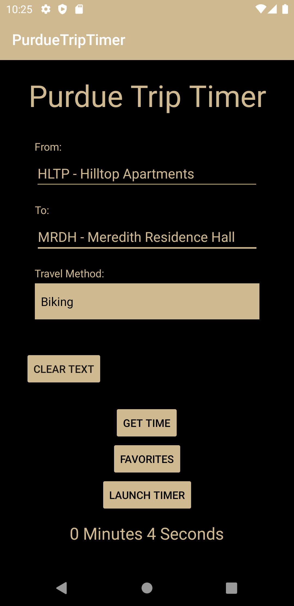

# Purdue TripTimer

Purdue TripTimer is a Hello World 2020 project by [@aaryan-gautam](https://github.com/aaryan-gautam), [@afshirazi](https://github.com/afshirazi), [@chrisx8](https://github.com/chrisx8), and [@HenryWellman](https://github.com/HenryWellman). See more information on [Devpost](https://devpost.com/software/purdue-triptimer).

Server-side implementation is at [chrisx8/purduetriptimer-server](https://github.com/chrisx8/purduetriptimer-server).

## Screenshots

[More screenshots](screenshots/)

## Inspiration

We never knew how long it would take to get from one building to another and we don't want anyone to have that problem in the future.

## What it does

Lets the user choose from some of the most popular locations on campus, choose a travel method, see an estimated time for their trip, and upload their own trip time information.

## How we built it

We built a mobile app using the Android SDK in Android Studio.

## Challenges we ran into

Weird bugs throughout, getting the `findFavorites()` method to work, getting the timer to pause and reset, server-side database errors.

## Accomplishments that we're proud of

We built an android app that actually runs properly with no previous relevant android experience.

## What we learned

- Real-life GitHub collaboration experience
- Fundamentals of Android app development
- Collaborating in a remote setting.

## What's next for Purdue TripTimer

- Implementing map functionality
- Cleaning up and polishing the user interface
- Show error messages from the server

## License

[MIT License](LICENSE)
